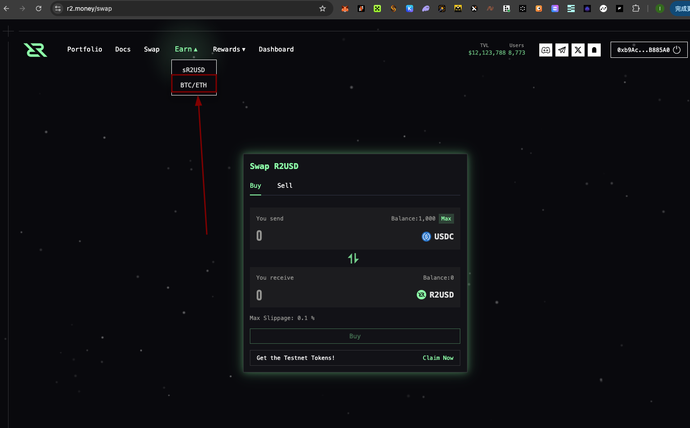
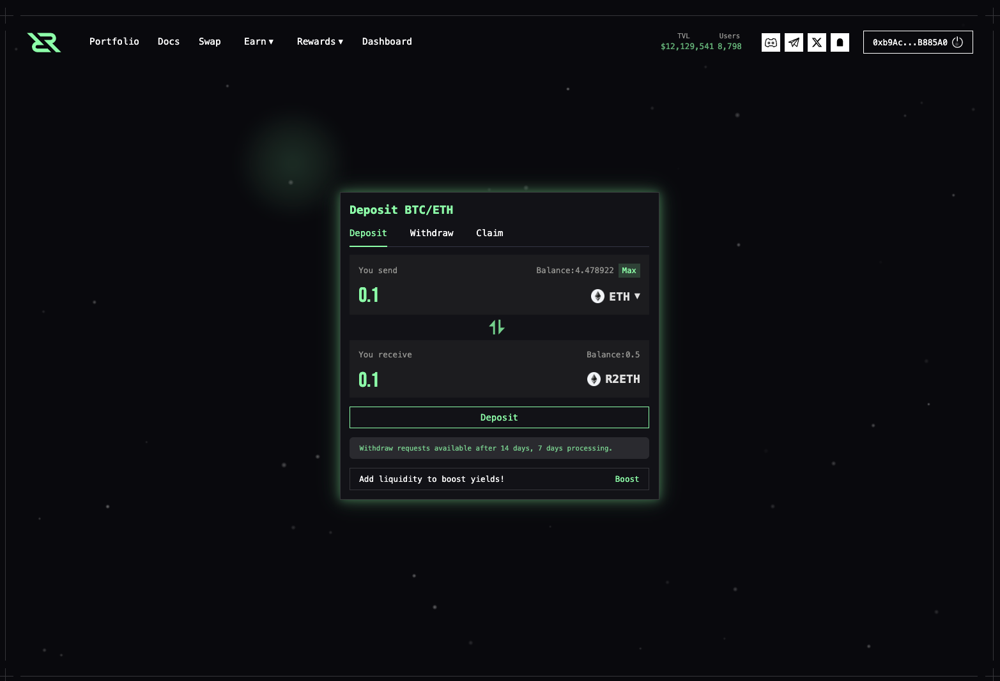
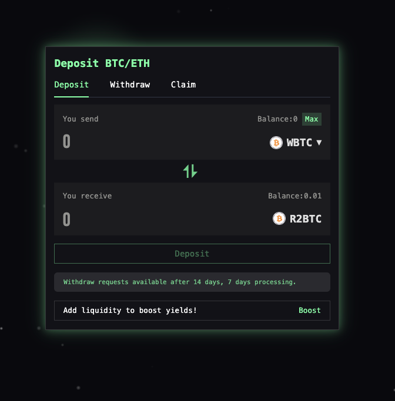
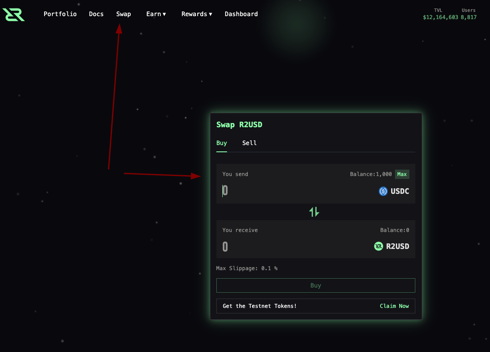
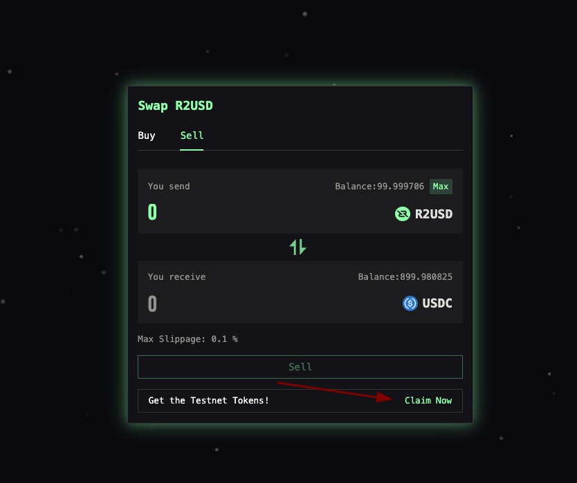

# R2项目撸毛教程

官方说明：https://r2money.gitbook.io/r2

**R2 是通往链上真实世界资产 （RWA） 收益策略的门户 ** ——专为认为稳定币应该做的不仅仅是保值的用户而设计。在 **RWAfi 运动**的最前沿，R2 通过让每个人都能获得机构级收益，将传统金融和 DeFi 连接起来。无论您是散户参与者还是机构配置者，R2 都提供了一个统一的入口点，以实现稳定、透明和可赎回的收益——完全在链上。

**测试网启动：** 测试网将于 4 月 17 日上线。明牌空投

**注册：https://r2.money?code=ZVF4D**

测试网点数（ ** 信号 ** ）每天更新。每价值 1 美元的代币，每小时可赚取  **1 个 Signal** 。示例：如果您持有 1 个 R2BTC，价格为 85,000 美元，您将获得： `85,000 × 24 = 2,040,000 Signals for the day.`

参与者将获得**信号**作为季节性奖励，可以在 TGE 兑换主网代币。

* 除了链上活动外，用户还可以通过 Galxe、Inspire 和其他平台完成任务来赚取额外的 Pulses（社交积分 ）。
* 脉冲和信号都可以在 TGE 兑换，但兑换比例不同
* 之前参加过 TG Bot 活动的用户将以 1：1 的比例将他们获得的筹码转换为脉冲，这将显示在投资组合界面中。
* 邀请系统最多支持  **3 个级别 ** 。基于邀请的积分每天结算。每天，用户获得的信号将根据每个级别的奖励结构部分记入其邀请者。

## 质押ETH

## 质押btc

## 质押USDC

先加入dc: [https://discord.gg/r2yield](https://discord.gg/r2yield)

然后进去testnet频道,发送/faucet+钱包地址，获取1000usdc+0.01btc，等待几分钟你钱包就会有！进入r2网站进行买卖。24小时领一次水

当你完成买卖，要去dc提交tokens

